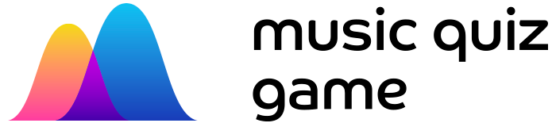
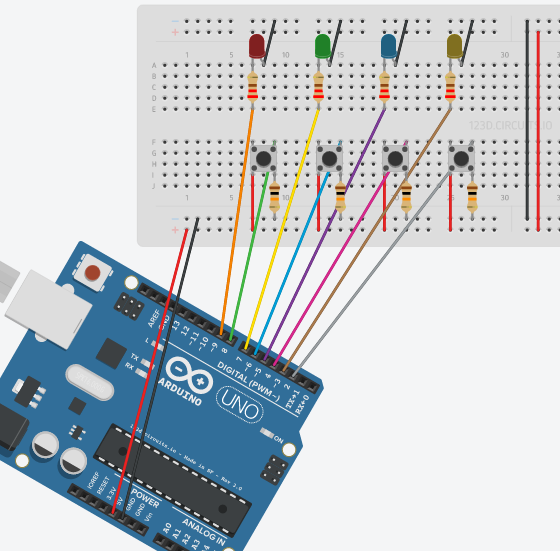

[](https://david-dm.org/chrisweb/arduino-nodejs-music-quiz-game)
[](https://david-dm.org/chrisweb/arduino-nodejs-music-quiz-game)
[](https://github.com/chrisweb/arduino-nodejs-music-quiz-game/releases)

# Arduino NodeJS Music Quiz Game

🚨⚠️ project is being re-written lot of things might currently be broken



A music quiz game using an arduino to record buttons input and nodejs as gameserver  

[musicquizgame.com](http://musicquizgame.com)  

say hello at [musicquizgame@gmail.com](mailto:musicquizgame@gmail.com)  

## Arduino buttons breadboard design



## start development

### install git  

if you haven't already installed git, do this first  

http://git-scm.com/download  

### project checkout  

if you are reading this you maybe already have a local copy of the project, if not then you can should use git to clone the latest master branch  

to do this you need open your command line tool and use the following command to clone (http://git-scm.com/docs/git-clone) this project into one of your directories (PROJECT_DIRECTORY_PATH)  

```
cd /PROJECT_DIRECTORY_PATH
```  

now clone the project into that directory  

```
git@github.com:chrisweb/nodejs-arduino-game.git
```  

if you are on windows you can also use the github desktop (https://desktop.github.com/) or if your use visual studio as IDE you can use the github for visual studio extension (https://visualstudio.github.com/)  

install github desktop or the visual studio extension, then go to the github open the project main page and click the green "clone or download" button  

### install Nodejs

if you haven't done this already, install nodejs from https://nodejs.org (which includes npm, the nodejs package manager)  

### update npm

to ensure you have the latest version of npm, update npm (https://docs.npmjs.com/getting-started/installing-node), open your command line tool and use the following command  

```
npm install npm@latest -g
```  

to check if you have the latest version type  

```
npm -v
```  

what the latest npm version is can be seen in their package.json https://github.com/npm/npm/blob/latest/package.json  

### ~~install yarn~~  

~~get yarn https://yarnpkg.com/~~  

~~or check if it the latest version is already installed~~  

!!! we postponed using yarn (use npm instead, see below), because there is a bug when checking out @types packages:  

https://github.com/yarnpkg/yarn/issues/825  
https://github.com/yarnpkg/yarn/issues/656  

```
yarn --version
```  

### open project directory  

go into the project directoy if you haven't already and then into the quizz-game directory  

```
cd /PROJECT_DIRECTORY_PATH/quizz-game
```  

### ⚠️ Serialport and node-gyp troubleshooting

!!! if you need to compile node-gyp, it is probably because you use the latest nodejs version, if you use the LTS version of nodejs the chance is high you won't have any trouble with node-gyp, so if troubleshooting still fails or takes too much time you might consider just switching to the nodejs LTS version and you will be able to instsall Serialport using a pre built node-gyp without trouble

Serialport is a nodejs addon that needs to get compiled

For the compilation node-gyp is being used

ON WINDOWS: If you don't have Python and Visual Studio installed on windows, node-gyp will fail and hence you won't be able to install the Serialport addon

The [node-gyp README](https://github.com/nodejs/node-gyp#installation) recommends to run the following command in a Powershell instance that you have to run as an Administrator to install the required tools

```
npm install --global --production windows-build-tools
```  

After this installing the dependencies should work, if it doesn't please check out the [nodejs documentation about compiling addons](https://github.com/Microsoft/nodejs-guidelines/blob/master/windows-environment.md#compiling-native-addon-modules) and if it still doen't work open a ticket

ON LINUX & MAC: For other operating systems check out the [node-gyp README](https://github.com/nodejs/node-gyp#installation)

### ~~install the development dependencies using yarn~~  

~~use yarn to fetch all the dependencies and put them into the node_modules directory~~  

```
yarn install
```  

!!! we postponed using yarn (use npm instead, see below), because there is a bug when checking out @types packages:  

https://github.com/yarnpkg/yarn/issues/825  
https://github.com/yarnpkg/yarn/issues/656  

### install the development dependencies using npm

use npm to fetch all the dependencies  

```
npm install
```  

This will fetch all the dependencies from https://www.npmjs.org/ that are listed in the project package.json and put them into a directory called node_modules  

!!! If you want to install the dependencies from within a Virtual Machine with a Linux operating system, but your shared folder is in windows then user "npm install --no-bin-link" (as windows does not support symlinks)  

### install gulp-cli globally

```
npm install gulp-cli -g
```
### install sass and ruby

download and install ruby:  
http://rubyinstaller.org/downloads/  

!!! if on windows: while installing ruby, check the box "add ruby to the windows path"

now install sass:

```
gem install sass
```

and / or to check if sass is installed, type:

```
sass -v
```

## add new dependencies (node_modules)

first to check the available package versions use  

```
npm view <package_name> versions
```

choose the latest version (this is for a prototype latest is ok) and install it  

if it's a dependency needed by the project to work, we use save so that it also gets added to the dependencies property of our package.json  

use the @ after the package name, to define the version you want to install  

```
npm install <package_name>@<version> --save
```

if it's a dependency only used during development use "--save-dev" so that it gets added to the devDependencies property of our package.json  

```
npm install <package_name>@<version> --save-dev
```

## create a configuration file  

open the server directory and copy the file configuration_example.ts, then rename it to configuration.ts  

edit the configuration file and add your own values  

the deezerProfileId is the id of the user profile you want the playlists to be fetched from by default (it can be any existing deezer account, it just needs to have some public playlists)  

if you don't have a deezer account yet, create one and add some playlists (at least one), then puts it's ID in the configuration file  

## build the project  

to build the project (create js files from ts source files, copies files, ...), type  

```
gulp build
```  

## rebuild in realtime  

while developing I recommend you enable gulp watch to ensure typescript and sass files get re-compiled on each time you save  

```
gulp watch
```

## start the server

```
node ./build/server
```

## build the docs (project website on github pages)  

to build the project website (on github pages), type  

```
gulp build-docs
```  

# Initial project setup

check out the [PROJECT_SETUP.md](./PROJECT_SETUP.md) file

# Licenses

Source code licensed under MIT

Logo, design, project name, domain name copyright (c) chris weber 2017

# Design

Designed by the awesome people at [Tubik Studio](https://tubikstudio.com)
